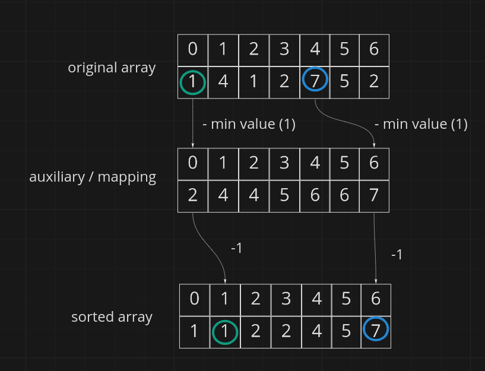

### What are limitations of counting sort?

- works only on integers or values that can be mapped to integers
- most efficient when the difference between the smallest and the biggest value not bigger than the total number of items in the array
- we need to know in advance the smallest and the biggest value so to create a proper auxiliary array

question id: 9078ea7a-35c6-4e43-a220-87db4c677054


### What is time complexity of counting sort and why?

It's O(n+k) where n is the total number of the elements in the array
and k is the difference between the smallest and the biggest value is not bigger than number of arrays

The smaller the k, the closer we to linear time. The bigger the k the worse.
K is a length of an auxiliary array that we used as a mapping between the original
array and the sorted array. Since our algorithm has to iterate over each and every
element in the auxiliary array, we don't want situations like when we have to sort
array like [0, 10000, 999999999], because having only three item we still have to
iterate over the auxiliary array 9999999999 times in order to sum its elements.

question id: cb09e260-a0d5-4753-bbe2-6a0519f0addc


### What is space complexity of counting sort?

It's O(n + k). k is the length of auxiliary array that we have to create and it is equal to the 
difference between the smallest and the biggest value of the array. For example, for array
like [0, 100] the n is only 2, but k is 100, thereby the space complexity is 102 in total which is 
too much for array of length 2.

question id: b703c37a-253c-4161-afab-2f7d84d7d1cc


### How does counting sort work?

Basically, we need to create a mapping between values of the original array and their
indexes in the sorted array.
We create this mapping in several steps:
- first we create an auxiliary array, where we count each occurence of each value in the original array
- then to the each value of the auxiliary array we add the previous value [1, 2 ,3] -> [1, 3, 6]
- then the difficult part. We take a value from the original array, we use it as index in the auxiliary array, by this index we get value from
the auxiliary array, this value-1 would be the index in the sorted array for the original value
- also we have to decrease value in the mapping by one each time we use it
  


question id: 5a14e5ad-583c-4094-bfca-a3d7dd23643e


### Sort a list of integers with using counting sort in Python

my_list = [49, 54, 45, 51, 41, 50, 46, 47]


```python
def counting_sort(
    original_list: list[int], min_value: int, max_value: int
) -> list[int]:
    pass


if __name__ == "__main__":
    my_list = [49, 54, 45, 51, 41, 50, 46, 47]

    sorted_list = sorted(my_list)
    sorted_by_counting_sort = counting_sort(my_list, 41, 54)

    assert (
        sorted_by_counting_sort == sorted_list
    ), f"Expected result: {sorted_list},\nactual result: {sorted_by_counting_sort}"
    print("succes!")
```


answer:

```python
def counting_sort(
    original_list: list[int], min_value: int, max_value: int
) -> list[int]:
    """Performs sorting of the given list using counting sort."""

    offset = min_value - 0  # in case original list starts with value bigger than zero

    auxiliary_list = [0] * (max_value - min_value + 1)
    output_list = [0] * len(original_list)

    # count how many times each value occurs in the original list
    for value in original_list:
        auxiliary_list[value - offset] += 1

    # add to every value previous value, e.g. [1, 2, 3, 4] -> [1, 3, 6, 10]
    for i in range(1, len(auxiliary_list)):
        auxiliary_list[i] += auxiliary_list[i - 1]

    # In order to find out what is the index of the value if the original list is sorted we need
    # to get a value from the auxiliary list using original value-1 as index
    # Don't forget to increment the value in the count list every time you access it
    for value_from_original_list in original_list:
        output_list[
            auxiliary_list[value_from_original_list - offset] - 1
        ] = value_from_original_list
        auxiliary_list[value_from_original_list - offset] -= 1

    return output_list


if __name__ == "__main__":
    my_list = [49, 54, 45, 51, 41, 50, 46, 47]

    sorted_list = sorted(my_list)
    sorted_by_counting_sort = counting_sort(my_list, 41, 54)

    assert (
        sorted_by_counting_sort == sorted_list
    ), f"Expected result: {sorted_list},\nactual result: {sorted_by_counting_sort}"
    print("succes!")
```

question id: 7ee855e7-1130-42b4-8b2d-0bb3c920303a


### Why do we need cumulative sum for counting sort?

Usually, in counting sort we not only count occurrences of each integer,
but we also then add up the previous integer to the next integer for the whole auxiliary array.

However, we can sort an array without adding anything, because they are already sorted: 
in your auxiliary array each index is the number from the original array and they are 
in order. So, why do we still need a cumulative sum?

answer:

Counting sort with cumulative sum is stable, but the other is unstable.
In terms of time and space complexity, both options are the same.

question id: 3d60b67d-acc3-4393-bf5d-b8c00c352db