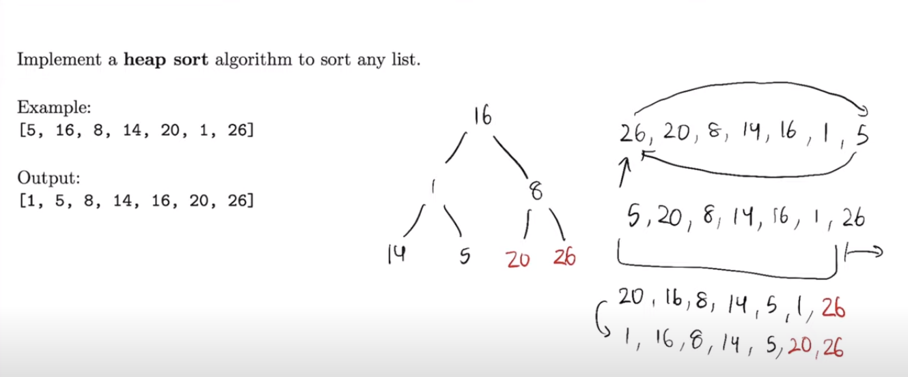

### How does heapsort work?

We know that in max heap the biggest value is the root. 
So we take this value and put it to the end of the array/heap, and value from the end
we put as a new root node. 
Now it violates the heap property, so we sift down the root value. 
Now the root node contains the biggest value again.
We repeat these operations, putting values from the biggest to the lowest from the end of the array to the beginning of the array.

Good visualization is here: https://www.youtube.com/watch?v=laYrbOAmuvQ

question id: ea922169-672d-4acb-8ac8-c88977f143d9

### What is time complexity of the heapsort and why?

It's O(n*log(n)).

To understand it's clearly you have to know how heapsort works. We are not going to describe it here.

Because every time we swap the root node with another element in the heap, 
we have to sift-down the value in root node.
So every element (n) have to be sifted-down (log(n)) which gives us O(n*log(n)).

question id: 5b5c2e8e-8798-46db-b567-a32382fd6e8b

### What is space complexity of the heapsort and why?

It's O(1) because it sort the array in place.

question id: 47aa6e8d-a05a-4f6f-98ea-15c78e4c21f0