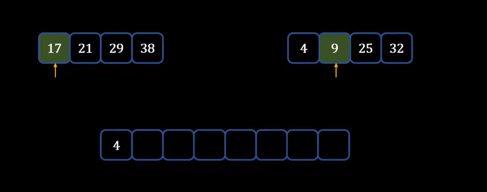
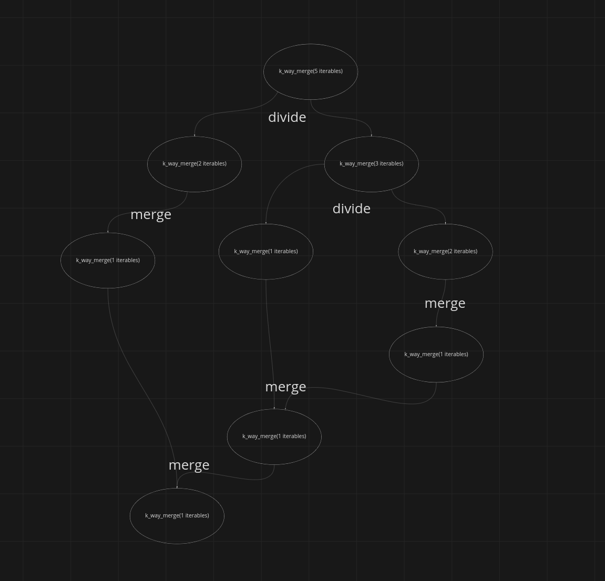

### How to merge (combine) two sorted iterables in theory?

For example, you have two file buffers or two generators, that 
yield some sorted values. How to combine it to one list?

For example, one file buffer has every phone numbers of mts in sorted way, and the other one has numbers of megafon
in sorted way. How to combine this two files into one sorted iterable/file/list? 

answer:

You have to write a generator that compares values from both inputs one by one. For example, in iteration 0 value from
the left iterable is the smallest, so we yield the left value and take the next value from the left iterator. The next 
time the right value is the smallest, so we yield the right value and take the new value from the right iterable.
When one of the iterables is exhausted, we yield all the values from the other one.



question id: 2581109e-0527-4ff4-a4e6-28c6280bf4aa


### What are time and complexity of a generator that combines two sorted inputs?

You have a generator like this that combines two sorted inputs like this:

```python
import typing as tp

VALUE = tp.TypeVar("VALUE")

first_list = [2, 7, 12, 20, 34, 77, 87]
second_list = [4, 9, 15, 20, 27, 66]

def two_way_merge(
    left_iterable: tp.Iterable[VALUE], right_iterable: tp.Iterable[VALUE]
) -> tp.Iterator[VALUE]:
    """
    Returns a generator that merges two sorted iterables.

    It does not exclude duplicates.
    """
    left = iter(left_iterable)
    right = iter(right_iterable)

    left_value = next(left)
    right_value = next(right)
    try:
        while True:
            if left_value > right_value:
                yield right_value
                return_left_if_stop_iteration = True
                right_value = next(right)
            else:
                yield left_value
                return_left_if_stop_iteration = False
                left_value = next(left)
    except StopIteration:
        if return_left_if_stop_iteration:
            yield left_value
            yield from left
            return

        yield right_value
        yield from right


print(list(two_way_merge(first_list, second_list)))
```

What are time and space complexity of it?

answer:

The time complexity would be O(n), linear, because you need to traverse both lists only once.

The space complexity, I guess, would be O(k), because you only need to the state of one iterator per input.

question id: 373fb07a-9f59-428c-9a2e-76b829fc6d0e


### How to merge several sorted arrays with two-way merge in O(nlogk) time in theory?

answer:

For example, your function 'k_way_merge()' was called with 10 sorted arrays as inputs. However, you can merge only
two arrays. So what do you do? Inside 'k_way_merge()' your call 'k_way_merge()' itself twice, but you path two both
of the only half of the arrays each. Then again. Until there is only two array, which two-way merge can handle.



question id: c909c585-2091-41bf-a091-e563811ecb08


### How is the algorithm of merging two sorted arrays is called?

answer:

Two-way merge

question id: 3a04074a-f04a-4fc6-be4d-c4dee3017600


### How is the algorithm for merging several sorted arrays is called?

answer:

k-way merge

question id: 0d342a98-66ee-4164-95e1-01014fd3f6a4


### Write a generator that merges (combines) two sorted iterables

For example, you have two file buffers or two generators, that 
yield some sorted values. How to combine it in one list?

```python
first_list = [2, 7, 12, 20, 34, 77, 87]
second_list = [4, 9, 15, 20, 27, 66]

def merge_two_sorted_iterables():
    # your function here

print(list(merge_two_sorted_iterables(first_list, second_list)))
```

answer:


```python
import typing as tp

VALUE = tp.TypeVar("VALUE")

first_list = [2, 7, 12, 20, 34, 77, 87]
second_list = [4, 9, 15, 20, 27, 66]

def merge_two_sorted_iterables(
    left_iterable: tp.Iterable[VALUE], right_iterable: tp.Iterable[VALUE]
) -> tp.Iterator[VALUE]:
    """
    Returns a generator that merges two sorted iterables.

    It does not exclude duplicates.
    """
    left = iter(left_iterable)
    right = iter(right_iterable)

    left_value = next(left)
    right_value = next(right)
    try:
        while True:
            if left_value > right_value:
                yield right_value
                return_left_if_stop_iteration = True
                right_value = next(right)
            else:
                yield left_value
                return_left_if_stop_iteration = False
                left_value = next(left)
    except StopIteration:
        if return_left_if_stop_iteration:
            yield left_value
            yield from left
            return

        yield right_value
        yield from right


print(list(merge_two_sorted_iterables(first_list, second_list)))
```

question id: 12655194-478d-482c-bb93-a90b5edd0190


### How to write an iterative k-way merge based on two-way merge?

For example, you have two-way merge function like this:

```python
import typing as tp

VALUE = tp.TypeVar("VALUE")

def two_way_merge(
    left_iterable: tp.Iterable[VALUE], right_iterable: tp.Iterable[VALUE]
) -> tp.Iterator[VALUE]:
    """
    Returns a generator that merges two sorted iterables.

    It does not exclude duplicates.
    """
    left = iter(left_iterable)
    right = iter(right_iterable)

    left_value = next(left)
    right_value = next(right)
    try:
        while True:
            if left_value > right_value:
                yield right_value
                return_left_if_stop_iteration = True
                right_value = next(right)
            else:
                yield left_value
                return_left_if_stop_iteration = False
                left_value = next(left)
    except StopIteration:
        if return_left_if_stop_iteration:
            yield left_value
            yield from left
            return

        yield right_value
        yield from right

def k_way_merge():
    # your code here


lst1 = [1, 3, 7, 12, 15]
lst2 = [2, 4, 6, 8, 10]
lst3 = [5, 9, 11, 13, 17]

print(list(k_way_merge(lst1, lst2, lst3)))  # [1, 2, 3, 4, 5, 6, 7, 8, 9, 10, 11, 12, 13, 15, 17]
```

answer:

```python
import typing as tp

VALUE = tp.TypeVar("VALUE")

def two_way_merge(left_value, right_value):
    pass

def k_way_merge(*iterables: tp.Iterable[VALUE]) -> tp.Iterator[VALUE]:
    """Merges any number of given iterables

    time complexity: O(nlogk)
    space complexity: O(1)
    """

    if len(iterables) == 1:
        yield from iterables[0]
    else:
        mid = len(iterables) // 2
        yield from two_way_merge(k_way_merge(*iterables[:mid]), k_way_merge(*iterables[mid:]))
```

question id: 1ce1599a-65a0-4ab4-a757-635b2f97331f


### What is the time complexity of this Python iterative k-way merge and why?

```python
import typing as tp

VALUE = tp.TypeVar("VALUE")

def two_way_merge(
    left_iterable: tp.Iterable[VALUE], right_iterable: tp.Iterable[VALUE]
) -> tp.Iterator[VALUE]:
    """
    Returns a generator that merges two sorted iterables.

    It does not exclude duplicates.
    """
    left = iter(left_iterable)
    right = iter(right_iterable)

    left_value = next(left)
    right_value = next(right)
    try:
        while True:
            if left_value > right_value:
                yield right_value
                return_left_if_stop_iteration = True
                right_value = next(right)
            else:
                yield left_value
                return_left_if_stop_iteration = False
                left_value = next(left)
    except StopIteration:
        if return_left_if_stop_iteration:
            yield left_value
            yield from left
            return

        yield right_value
        yield from right

def k_way_merge(*iterables: tp.Iterable[VALUE]) -> tp.Iterator[VALUE]:
    """Merges any number of given iterables

    time complexity: O(nlogk)
    space complexity: O(1)
    """

    if len(iterables) == 1:
        yield from iterables[0]
    else:
        mid = len(iterables) // 2
        yield from two_way_merge(k_way_merge(*iterables[:mid]), k_way_merge(*iterables[mid:]))
```

answer:

Time complexity is O(nlogk), where k - number of sorted arrays / inputs, n - total number of the elements in all 
arrays (sum of elements of k arrays)

In iterative k-way merge we are merging the first array with the second, the third with the fourth, and so on. 
As the number of arrays is halved in each iteration, there are only Θ(log k) iterations (like in binary search). 

In each iteration every element is moved exactly once. The running time per iteration is therefore in Θ(n) as n 
is the number of elements. The total running time is therefore in Θ(n log k).


question id: 79a01f13-7aa2-4da3-bce1-8b94724d62f0


### What is the space complexity of this Python iterative k-way merge and why?

```python
import typing as tp

VALUE = tp.TypeVar("VALUE")

def two_way_merge(
    left_iterable: tp.Iterable[VALUE], right_iterable: tp.Iterable[VALUE]
) -> tp.Iterator[VALUE]:
    """
    Returns a generator that merges two sorted iterables.

    It does not exclude duplicates.
    """
    left = iter(left_iterable)
    right = iter(right_iterable)

    left_value = next(left)
    right_value = next(right)
    try:
        while True:
            if left_value > right_value:
                yield right_value
                return_left_if_stop_iteration = True
                right_value = next(right)
            else:
                yield left_value
                return_left_if_stop_iteration = False
                left_value = next(left)
    except StopIteration:
        if return_left_if_stop_iteration:
            yield left_value
            yield from left
            return

        yield right_value
        yield from right

def k_way_merge(*iterables: tp.Iterable[VALUE]) -> tp.Iterator[VALUE]:
    """Merges any number of given iterables

    time complexity: O(nlogk)
    space complexity: O(1)
    """

    if len(iterables) == 1:
        yield from iterables[0]
    else:
        mid = len(iterables) // 2
        yield from two_way_merge(k_way_merge(*iterables[:mid]), k_way_merge(*iterables[mid:]))
```

answer

The space complexity of iterative k-way merge is linear - O(n).
Why is so?

For example, insertin sort and selection sort - they sort arrays in place with O(1) space complexity.
Merge sort, basically, creates new array in the process of sorting. That's why it's space complexity is linear O(n).

**However, if you make k-way-merge on generators in Python, I think the space complexity will be O(1).**

There is also a good explanation here: https://stackoverflow.com/questions/10342890/merge-sort-time-and-space-complexity

question id: 486365c4-7f99-4a17-bf63-d273473cd4ff


### Write a function in Golang, that merges n sorted iterables

```golang
package main

import "fmt"

// your code here


func main() {

	lst1 := []int{1, 3, 7, 12, 15}
	lst2 := []int{2, 4, 6, 8, 10}
	lst3 := []int{5, 9, 11, 13, 17}

	sortedNumbers := kWayMerge(lst1, lst2, lst3)
	fmt.Println(sortedNumbers) // [1 2 3 4 5 6 7 8 9 10 11 12 13 15 17]
}
```

answer


```golang
package main

import "fmt"

func twoWayMerge(left, right []int) []int {
	left_index := 0
	right_index := 0
	index := 0

	resultingSlice := make([]int, len(left)+len(right))

	for left_index < len(left) && right_index < len(right) {

		left_value := left[left_index]
		right_value := right[right_index]

		if left_value < right_value {
			resultingSlice[index] = left_value
			left_index++

		} else {
			resultingSlice[index] = right_value
			right_index++
		}

		index++
	}

	for ; left_index < len(left); left_index++ {
		resultingSlice[index] = left[left_index]
		index++
	}
	for ; right_index < len(right); right_index++ {
		resultingSlice[index] = right[right_index]
		index++
	}

	return resultingSlice
}

func kWayMerge(slices ...[]int) []int {
	len_slices := len(slices)

	if len_slices == 1 {
		return slices[0]
	}

	mid := len_slices / 2

	return twoWayMerge(kWayMerge(slices[:mid]...), kWayMerge(slices[mid:]...))

}

func main() {

	lst1 := []int{1, 3, 7, 12, 15}
	lst2 := []int{2, 4, 6, 8, 10}
	lst3 := []int{5, 9, 11, 13, 17}

	sortedNumbers := kWayMerge(lst1, lst2, lst3)
	fmt.Println(sortedNumbers) // [1 2 3 4 5 6 7 8 9 10 11 12 13 15 17]
}
```

question id: 6b3bbe2b-b468-4cfe-b180-9042d634eddc