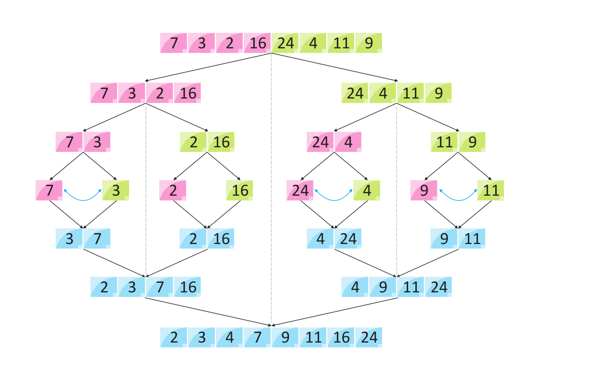
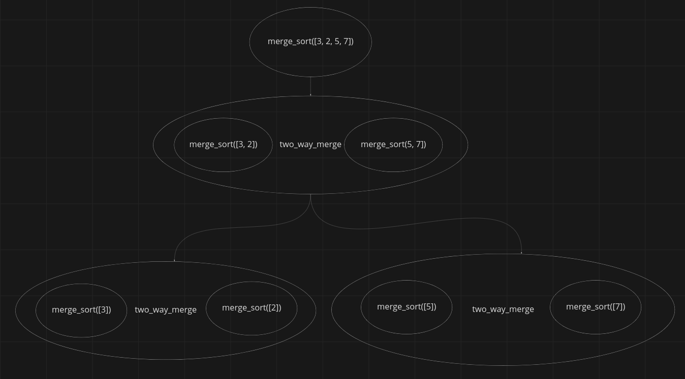
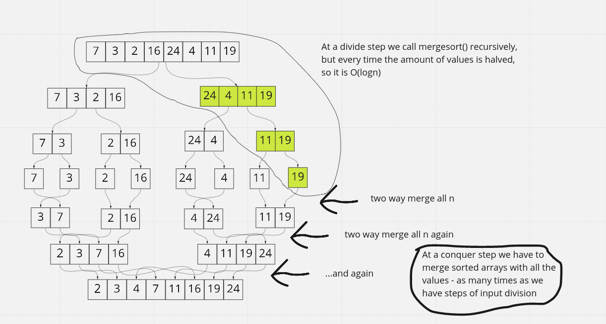
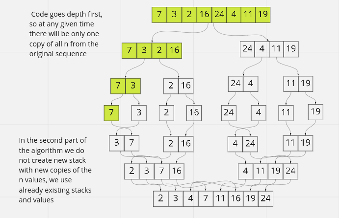

### How does merge sort work in theory?

It uses divide and conquer approach.

Divide step:
- to break the given array into smaller once recursively until
there are n arrays with only one element in each of arrays

Conquer step:
- merge all arrays using same technique as in two-way merge

That's how it looks in theory:


That's how it looks in code:


https://youtu.be/nCNfu_zNhyI

question id: beece6fd-5f99-4266-8ff7-db322d2e97ec


### How to write merge sort in Python?

```python
some_unsorted_list = [3, 0, 8, 5, 1, 17, 39]

def two_way_merge(left: tp.Iterable[int], right: tp.Iterable[int]) -> tp.Iterable[int]:
    left_iter = iter(left)
    right_iter = iter(right)

    try:
        next_left = next(left_iter)
    except StopIteration:
        yield from right_iter
        return

    try:
        next_right = next(right_iter)
    except StopIteration:
        yield from left_iter
        return

    while True:
        if next_left < next_right:
            yield next_left
            try:
                next_left = next(left_iter)
            except StopIteration:
                yield next_right
                yield from right_iter
                return

        else:
            yield next_right
            try:
                next_right = next(right_iter)
            except StopIteration:
                yield next_left
                yield from left_iter
                return

def merge_sort():
	# write your code here using the function above
    pass

print(merge_sort(some_unsorted_list))  # [0, 1, 3, 5, 8, 17, 39]
```

answer:

```python
import typing as tp

VALUE = tp.TypeVar("VALUE")

some_unsorted_list = [3, 0, 8, 5, 1, 17, 39]


def two_way_merge(left: tp.Iterable[VALUE], right: tp.Iterable[VALUE]) -> tp.Iterator[VALUE]:
    """Generators that merges two sorted iterables."""

    left_iter = iter(left)
    right_iter = iter(right)

    left_value = next(left_iter)
    right_value = next(right_iter)

    try:
        while True:
            if left_value > right_value:
                yield right_value
                return_left_if_stop_iteration = True
                right_value = next(right_iter)
            else:
                yield left_value
                return_left_if_stop_iteration = False
                left_value = next(left_iter)
    except StopIteration:
        if return_left_if_stop_iteration:
            yield left_value
            yield from left_iter
            return

        yield right_value
        yield from right_iter


def merge_sort(sequence: tp.Sequence[VALUE]) -> tp.Sequence[VALUE]:
    """Sorts given sequence from the lowest to the highest value."""
    len_sequence = len(sequence)

    if len_sequence == 1:
        yield from sequence
        return

    mid = len_sequence // 2
    yield from two_way_merge(merge_sort(sequence[:mid]), merge_sort(sequence[mid:]))
```

question id: 7d263973-23e3-4c99-a49b-fa729ee8480c


### What is a merge sort time complexity (average, worst, best) and why?

In's O(nlogn) in any case.
Why?
First, the mergesort has two steps. In the first step, it calls itself repeatedly, but every time with
half of the input. That's why, like in binary search, this step is O(logn). This means, that if the
length of the input is 1012, mergesort will have to call itself 10 times.
And every time of this 10 times it has to merge all its elements. Two-way merge is O(n), so if we repeat
it for every step, we get O(n * logn).



question id: ea265df1-3555-4d76-a04a-0a70d053bf75


### What is a mergesort space complexity and why?

It's O(n), because it makes one copy of the given array.

Mergesort is a recursive algorithm that calls itself two times with half of the input for each
brunch, until there is only one value in each array. So it looks like an upside down tree, that
grows exponentially. And on every level of recursion we have all the values of our original input.
So it seems like we are using a lot of memory. But it is not true.

Remember, that our code is Depth first. So, it will go one call at a time until it reaches the bottom
and only then it will go to the other branch. Therefore, in any given moment we only have one copy of
all the values of the original input.



https://stackoverflow.com/questions/10342890/merge-sort-time-and-space-complexity

question id: e50914a2-02d4-4e16-849c-c4f45e8656a3


### How to write merge sort in Golang?

```golang
package main

import "fmt"

// your code here

func main() {
	notSortedNumbers := []int{23, 2, 39, 5, 99, 17, 50}

	sortedNumbers := mergeSort(notSortedNumbers)
	fmt.Println(sortedNumbers) // [2 5 17 23 39 50 99]

}
```

answer

```golang
package main

import "fmt"

func twoWayMerge(left, right []int) []int {
	left_index := 0
	right_index := 0
	index := 0

	resultingSlice := make([]int, len(left)+len(right))

	for left_index < len(left) && right_index < len(right) {

		left_value := left[left_index]
		right_value := right[right_index]

		if left_value < right_value {
			resultingSlice[index] = left_value
			left_index++

		} else {
			resultingSlice[index] = right_value
			right_index++
		}

		index++
	}

	for ; left_index < len(left); left_index++ {
		resultingSlice[index] = left[left_index]
		index++
	}
	for ; right_index < len(right); right_index++ {
		resultingSlice[index] = right[right_index]
		index++
	}

	return resultingSlice
}

func mergeSort(numbers []int) []int {
	len_numbers := len(numbers)

	if len_numbers == 1 {
		return numbers
	}

	mid := len_numbers / 2

	return twoWayMerge(mergeSort(numbers[:mid]), mergeSort(numbers[mid:]))

}

func main() {
	notSortedNumbers := []int{23, 2, 39, 5, 99, 17, 50}

	sortedNumbers := mergeSort(notSortedNumbers)
	fmt.Println(sortedNumbers)

}
```

question id: 803818ff-27c9-47e9-bc68-d1d65c8ed204