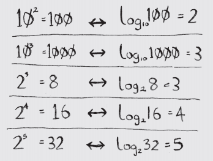

### What is an algorithm? 

An algorithm is a set of instructions for accomplishing a task

question id: d549dca7-790b-4014-932f-8d8e24feb67e

### What is Big O notaion? 

It's mathematical notation that is used to describe scalability of an algorithms. In other words,
how would the number of operations grow if the value of elements grows in a certain way.

For example, if an algorithm has O(1) or constant time complexity, the number of operations doesn't
change no matter how many values you have, just one or one billion. For O(n) or linear time complexity
the number of operations grows linearly with number of values etc.

question id: 02c10817-5641-40b5-acb5-f10977bb5b4a

### What is the difference between constant O(1) and linear O(n) time complexity?

An algorithm has constant time complexity if it takes the same time regardless of the number of inputs.

Imagine looking up for value in an array one value by one from head to tail. If array's size is
10, you may have to check all the 10 cells. If there array consist of 100 values, you might as
well have to check 100 cells. So the growth of number of operations is the same is growth 
of number of items in array.

Now consider a hash map. No matter 10, 100 or 1,000,000 elements in a hash map, the number
of operations to find a value by key always (if there is no collisions) stays the same. In 
this case you only need to hash your key once, get the index in array and get the value from 
the array. 

question id: 731cb9ba-f901-40aa-96c8-dfc5efe55bde

### What does constant - O(1) - time complexity mean?

1 item = 1 operation
100 items = 1 operations
1000 items = 1 operations

No matter how many elements we have, it's always just one operation to execute. Take a hash map for example.
No matter how many elements you have in you hash map, to find a value by key is always (let's pretend we don't
have collisions) - the same number of opertions. In controversy, to find a value in a list takes as many
operations as we have elements, because you need to access every element.

question id: 6d7973f0-a9ef-41d4-b71f-8eb78140aad7

### How to read logarithms?

Logarithm is a flip of exponential. 
log10 100 is like asking, “How many 10s do we multiply
together to get 100?” The answer is 2: 10 × 10. So log10 100 = 2

Or:
log2 1024
in what exponent should we take 2 to get 1024? 2**10 = 1024. So the answer is 10.   

question id: 9ef37e7d-6a8e-4b12-ae0f-463b5ef5ada7

### What does logarithmic - O(logn) - time complexity mean?

1 item = ~1 operation
100 items = ~7 operation
1000 items = ~10 operations
2000 items = ~11 operations

Example: binary search has  O(logn) time complexity 

question id: 60d32711-29aa-41ea-a55d-4e97e30f0dbc

### What does linear - O(n) - time complexity mean?

1 item = 1 operation
100 items = 100 operations
1000 items = 1000 operations

For 1000 additional items we will need to execute 1000 additional operations

question id: f82709a5-152f-404b-8102-acceb051a7f0

### What's O(nlogn) time complexity means?

Let's compare it to linear time complexity - O(n) - where we have to process each and every of given elements, but only ones.
In O(nlogn) time complexity we have to process all the elements, but only only ones, but logn times.

So if you have 128 elements in total, you have to process them 7 times (because log128 = 7).

Though it's better than quadratic (O(n^2)) time complexity.

1 item = 1 operations
128 items = 128 * 7 = 896 operations
1024 items = 1024 * 10 = 10240 operations

question id: 0b8b1b86-dfe1-49c4-87af-6a78efb6c545

### What's quadratic - O(n^2) - time complexity means?

1 items = 1 operation
100 items = 10,000 operations
1000 items = 1,000,000 operations

For every additional 1000 items, we would require 1,000,000 additional operations

question id: 483eb155-9020-43d5-99ae-b194ba0a5858

### What does exponential - O(2^n) - time complexity mean?

1 items = ~ 2 operations
2 items = 4 operations
3 items = 8 operations
4 items = 16 operations

With every additional item the number or operation will double.

100 items = 1267650600228229401496703205376 operations
1000 items = 10715086071862673209484250490600018105614048117055336074437503883703510511249361224931983788156958581275946729175531468251871452856923140435984577574698574803934567774824230985421074605062371141877954182153046474983581941267398767559165543946077062914571196477686542167660429831652624386837205668069376

question id: 099eef35-4086-497f-bbf3-29917b366dd5

### How many are there days or years in a million seconds? in a billion? in a trillion?

a million seconds -> 12 days
a billion seconds -> 31 years
a trillion seconds -> 31688 years

question id: 520c0d59-8e1e-45fa-b376-047fd42f88e8