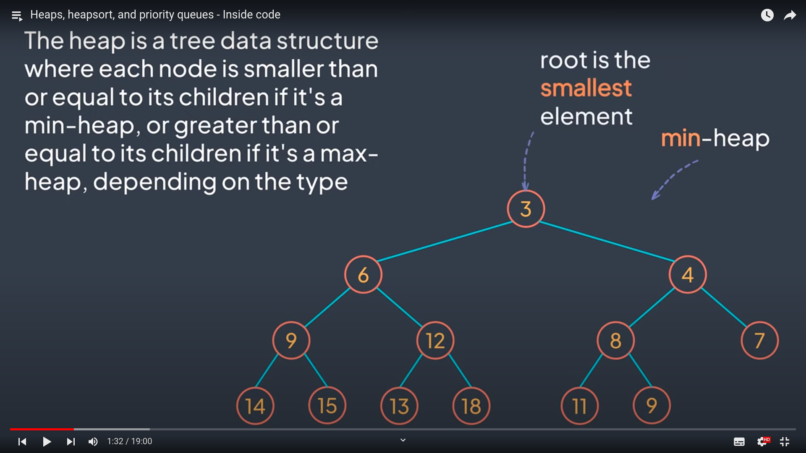

### What is (binary) heap?

answer:

Heap is a data structure. There are min and max heaps.
Min (binary) heap is a complete binary tree where each node is smaller or equal than its children.
Max heap is vice versa.

question id: c2db53f7-7be8-444e-841d-f8ee3c1169b3

### What is the smallest element in a min heap?

answer:

The smallest element in a min heap is always the root node

question id: a412232d-35f1-484b-9404-bb7fad843666

### What happens when we insert a new element in a min heap?

answer:

When we insert an element, it always goes to a free spot, looking top to bottom, left to right

If element that we inserted is less than its parent, we can bubble it up by comparison with its ascendants.

https://youtu.be/pLIajuc31qk?t=218

question id: 2a008d1e-32ad-4b29-93b2-cc5eab9bc3d0

### Min heap: if parent node is less than both of its children, with which of its children the parent node will be swapped?

answer:

With the smallest one of its children

question id: 8a6a2a88-a4b8-49cc-91c9-89d07ca806c3

### What happenes if we remove/extract the root node from a min heap?

If we remove the smallest element (the root node):
    0. We put the last inserted element as a new root node (doesn't matter if it is smaller than its children or not)
    1. Then we compare new root node to its children and swap it with the smallest child if it is smaller then the root node (repeat until heap property is satisfied)

question id: 1a4d5c1c-5873-4363-be63-9866986f8d2b

### How can we store a heap in a memory?

We can store min heap as an array because we can easily calculate the index 
of parent and/or children nodes of any given element

question id: 5a9a163a-400e-4f34-a433-8af476075806

### What is 'to heappify'?

Rearrange a heap to maintain the heap property, that is, 
the key of the root node is more extreme (greater or less) than or equal to the keys of its children.

question id: b32dfc36-e0a9-447e-ae07-26d0a8965735

### What applications do heaps have?

Heaps are used in

- heapsort
- priority queues 
- Dijkstra's algorithm for finding the shortest path

question id: e6396459-47d0-4070-9b32-4d0594e76032

### How to find indexes of the child nodes of a parent node in a heap respresented as an array?

Legend: 
x - index of the parent node
l - index of the left child
r - index of the right child

l = 2x + 1
r = 2x + 2

question id: 5c11996d-e81b-486d-894d-9fe6963dd406

### How to find an index of the parent node by index of its child in a heap respresented as an array?

parent node index = (child node index - 1) / 2

question id: not gonna learn by heart

### How to determine the hight of the heap knowing the number of its elements?

Height of the heap is **logn** where n is the number of elements in the heap.

question id: 1368a89c-a52e-4947-9ec1-bb216c1dca66

### How operations to rearrange a value inside heap are called?

answer:

**sift up** and **sift down**

question id: ad044984-568b-4447-93c2-3e305497cdb8

### What is time complexity of sift up (or down) operation in a binary heap and why?

answer:

The time complexity of **sift up / down** in a binary heap is **O(logn)**. It is because on every comparison the number
of elements to compare with halves. And there cannot be more comparison than the height of the heap. And the
height of the heap is logn where n is the total number of elements in a heap.

question id: 25d6cbbc-6f28-4290-a404-65e37104465c

### What is time complexity of getting min/max element from mix/map heap correspondently and why?

It's O(1) because the lowest/highest element is always the root node in min/max heaps

https://youtu.be/pLIajuc31qk

question id: 628f8fa2-838c-4b75-a6c9-2131704ae97b

### What is time complexity of extracting/removing root node from min/max binary heap and why?

It is O(logn) because when we remove the root node, on its place we put the last inserted value, then we
sift down this value to satisfy the heap property. And time complexity of sifting down is O(logn).

https://youtu.be/pLIajuc31qk

question id: c6dd0120-235e-49d1-98f6-186a9a3bf4b6

### What is time complexity of finding an index of a node by its value in a binary heap?

answer:

It's linear - O(n)

https://youtu.be/pLIajuc31qk

question id: 6ad5bf7a-ad45-4ac4-aaf7-08631d8f1357

what is a tree?
what is a binary tree?
what is a complete binary tree?
what is heapsort?
what is a priority queue?

