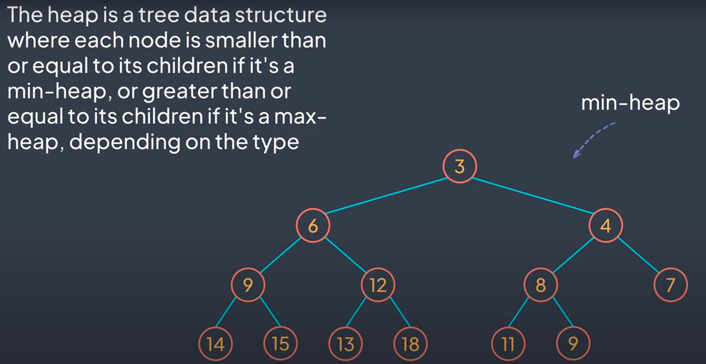

### What is (binary) heap?

answer:

Heap is a data structure. There are min and max heaps.
Min (binary) heap is a complete binary tree where each node is smaller or equal than its children.
Max heap is vice versa.

question id: c2db53f7-7be8-444e-841d-f8ee3c1169b3

### What is the smallest element in a min heap?

answer:

The smallest element in a min heap is always the root node

question id: a412232d-35f1-484b-9404-bb7fad843666

### What happens when we insert a new element in a min heap?

answer:

When we insert an element, it always goes to a free spot, looking top to bottom, left to right

If element that we inserted is less than its parent, we can bubble it up by comparison with its ascendants.

https://youtu.be/pLIajuc31qk?t=218

question id: 2a008d1e-32ad-4b29-93b2-cc5eab9bc3d0

### Min heap: if parent node is less than both of its children, with which of its children the parent node will be swapped?

answer:

With the smallest one of its children

question id: 8a6a2a88-a4b8-49cc-91c9-89d07ca806c3

### What happenes if we remove/extract the root node from a min heap?

If we remove the smallest element (the root node):
    0. We put the last inserted element as a new root node (doesn't matter if it is smaller than its children or not)
    1. Then we compare new root node to its children and swap it with the smallest child if it is smaller then the root node (repeat until heap property is satisfied)

question id: 1a4d5c1c-5873-4363-be63-9866986f8d2b

### How can we store a heap in a memory?

We can store min heap as an array because we can easily calculate the index 
of parent and/or children nodes of any given element

question id: 5a9a163a-400e-4f34-a433-8af476075806

### What is 'to heapify'?

Rearrange a heap to maintain the heap property, that is, 
the key of the root node is more extreme (greater or less) than or equal to the keys of its children.

question id: b32dfc36-e0a9-447e-ae07-26d0a8965735

### What applications do heaps have?

Heaps are used in

- heapsort
- priority queues 
- Dijkstra's algorithm for finding the shortest path

question id: e6396459-47d0-4070-9b32-4d0594e76032

### How to find indexes of the child nodes of a parent node in a heap respresented as an array?

Legend: 
x - index of the parent node
l - index of the left child
r - index of the right child

l = 2x + 1
r = 2x + 2

question id: 5c11996d-e81b-486d-894d-9fe6963dd406

### How to find an index of the parent node by index of its child in a heap respresented as an array?

parent node index = (child node index - 1) / 2

question id: not gonna learn by heart

### How to determine the hight of the heap knowing the number of its elements?

Height of the heap is **logn** where n is the number of elements in the heap.

question id: 1368a89c-a52e-4947-9ec1-bb216c1dca66

### How are called operations to rearrange a value inside heap?

answer:

**sift up** and **sift down**

question id: ad044984-568b-4447-93c2-3e305497cdb8

### What is time complexity of sift-up (or -down) operation in a binary heap and why?

answer:

The time complexity of **sift up / down** in a binary heap is **O(logn)**. It is because on every comparison the number
of elements to compare with halves. And there cannot be more comparison than the height of the heap. And the
height of the heap is logn where n is the total number of elements in a heap.

question id: 25d6cbbc-6f28-4290-a404-65e37104465c

### What is time complexity of getting min/max element from mix/map heap correspondently and why?

It's O(1) because the lowest/highest element is always the root node in min/max heaps

https://youtu.be/pLIajuc31qk

question id: 628f8fa2-838c-4b75-a6c9-2131704ae97b

### What is time complexity of extracting/removing root node from min/max binary heap and why?

It is O(logn) because when we remove the root node, on its place we put the last inserted value, then we
sift down this value to satisfy the heap property. And time complexity of sifting down is O(logn).

https://youtu.be/pLIajuc31qk

question id: c6dd0120-235e-49d1-98f6-186a9a3bf4b6

### What is time complexity of inserting a new node to a mix(or max) heap?

It's O(log(n)). Why?
First, you insert a value to the end of the heap. It's O(1).
However, then you have to restore heap property of the heap, or, in other words, bubble up the value
that you have just insorted if it less (or greater) than its parent. It's O(log(n))
because the maximun number of times it will be swapped is limited by maximum number of levels in the
heap, which is alway log(n) for a binary tree.

question id: 14ccf126-2986-4643-816b-982bbadce7a3

### What is time complexity of building a heap from an array (heapify) and why?

It's O(n). Why?

For example, we take sift-down approach and start from the end of the heap (bottom right leaf) and
we go from right to left, from the bottom to the top.

We know that time complexity of sift down is O(logn) and we need to appy it 
to the half of the total number of element of the heap (half is because you do not have 
to apply it to the very bottom of the heap because nodes there do not have children, and also the very bottom level 
of complete binary tree contains half of the nodes of the tree),
so it seems like building a heap takes (nlog(n/2)) which is the same as (nlog(n)).

However, the real time complexity of buidling a heap is O(n). Why not log(n) as sift-down is log(n)?
Because in reality elements don't have to go all the way down from the root node to the bottom level.
Only to sift down the root node is log(n). To sift down the children of the root node would be at least one
operation less for each as there are less levels to travers. For example, the level next to the 
bottom contains a quarter of all elements, and for all of them there would be only one operation to sift them down.

question id: 579b2931-7b27-4a1a-b74d-791fa8a09d08

### What is more preferred operation for building up a heap? Sift-up of sift-down? And why?

For building a heap from an array you can choose sift-up or sift-down operation. 
One leads to far less operations than the other. 

Imagine you have a heap of 16 elements, that means that the height of the heap is 4
(because hight of binary tree is O(logn)). That means that root node is 4 levels 
from the bottom nodes, and nodes on the bottom level are 4 levels from the root node. 

However, there are only 1 node that is the deepest - the root node. And
only two nodes (children of the root node) that are 3 level (out of 4) from the bottom. 
At the same time, there are at most 8 elements on the bottom. So, what is more optimal - 
sift down 1 root element through 4 levels or sift up 8 elements through 4 levels? 
I hope you see that sifting-down takes less operations for building a heap.

sift-up

sift-down

https://youtu.be/Dvq-YKeuO9Y?t=1182

question id: 27f9652e-d241-44f0-8d2c-34e133e424dd

### What is time complexity of finding an index of a node by its value in a binary heap?

answer:

It's linear - O(n)

https://youtu.be/pLIajuc31qk

question id: 6ad5bf7a-ad45-4ac4-aaf7-08631d8f1357

what is a tree?
what is a binary tree?
what is a complete binary tree?
what is heapsort?
what is a priority queue?

