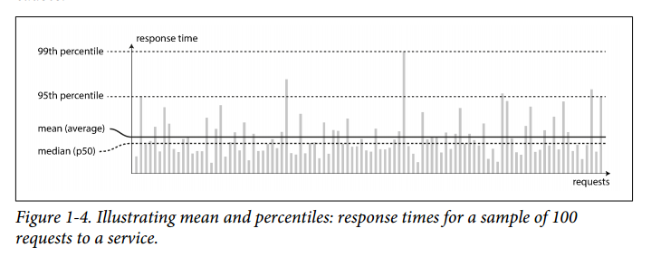

### What are main requirements for most software systems? (3)

- Reliability - the system should continue to work correct even in the face of adversity (hardware, software, human erros)
- Scalability - the system should not have any architectural ceiling that would prevent it from working as data grows 
- Maintainability - other people should be able to work productively on that system (clear design, common patters, documentation)

question id: 039b92aa-bcfb-41d1-8c34-b182322c8fbf


### What are typical expectations of reliable software? (4)

- performs in expected way
- tolerates users errors
- perfomance is good enough for required use case under reasonable workload
- the system prevents any unauthorized access and abuse.

question id: ec5a595d-31a0-4eec-ba1e-c916db035fde


### What are typicall causes or errors? (3)

- hardware errors
- software erorrs
- human errors

question id: 382e3dff-ef3b-4245-a502-35c10c29b0f5


### How can we prevent or minimize damage inflicted by hardware errors?

Our first response is usually to add redundancy to the individual hardware 
components in order to reduce the failure rate of the system. Disks may be set up in a RAID
configuration, servers may have dual power supplies and hot-swappable CPUs, and
datacenters may have batteries and diesel generators for backup power.

Nowadays it is more about adding more machines and to be able to tolerate the loss of the whole
machine or even several of them.

question id: 920354bb-4962-4e6a-b334-04a438271abc


### What is most common cause of software errors?

When the software is making some kind of assumption about its environment 
and while that assumption is usually true, it eventually stops being true for
some reason. 

If a system is expected to provide some guarantee (for example, in a message queue,
that the number of incoming messages equals the number of outgoing messages), 
it can constantly check itself while it is running and raise an alert if a discrepancy is found.

question id: e2f55f82-caf6-427c-9c09-184db60c104


### How to prevent user errors (5)?

answer

- design systems in a way that minimizes opportunities for error.
- test thoroughly at all levels, from unit tests to whole-system integration tests and
manual tests
- allow quick and easy recovery from human errors, to minimize the impact in the
case of a failure
- set up detailed and clear monitoring, such as performance metrics and error
rates
- provide sandboxes where suitable and possible

question id: e2513bb8-b96c-4e57-837f-2ff3636d4d02


### What does scalability means? 

Discussing scalability means considering questions like 
“If the system grows in a particular way,
what are our options for coping with the growth?” 

question id: cf42d736-fb0c-4d90-b448-e3ed75c9e3ab


### Where even to start thinking about scalability of your software?

First we need to describe our current average load by parameters that are important
for our software. The best choice of parameters
depends on the architecture of your system: it may be requests per second to a web
server, the ratio of reads to writes in a database, the number of simultaneously active
users in a chat room, the hit rate on a cache, or something else.

question id:  f7f9d67c-7bc1-4c8b-bacc-a4f6a9c96598


### Select all tweets for your timeline

For example, there are table:
- tweets (with sender_id)
- users (with id)
- follows (m2m with follower_id and followee_id)

How can you select all tweets from people your follow to make 
some kind of timeline of recent tweets?

answer

```SQL
SELECT tweets.*, users.* FROM tweets
JOIN users ON tweets.sender_id = users.id
JOIN follows ON follows.followee_id = users.id
WHERE follows.follower_id = current_user
```

question id: 667b8ac6-c178-413a-84bb-ca9d144c3482


### Twitter problem

Imagine that you are designing Twitter and you need to cope with 
a lot of users that are following each other, tweeting constantly 
and scrolling their home timeline. Nobody wants to wait a long time
while our service goes though several tables, gathering all the tweets
of all people whom a particular user follows - each time. 

How can we speed things - getting all the tweets for your timeline - up?

answer
1. Cache on client will save you from useless calls to database, but 
for new tweets it won't work, you still have to find and pull them.

2. Caching tweets after they were requested (user requests home timeline update
-> service finds and fetches all the relevant tweets - we put them to user
bespoke cache) won't really help either - you still have to wait if there 
are many NEW tweets that are not in any of caches.

3. Twitter came up with the idea of writing tweets in user bespoke caches not after
tweets are requsted, but immediately after they are posted. 
Imagine, that Mike follows Jennis. Jennis posts a new tweet. 
This tweet goes to Mike home timeline cache right away before he requested it. 
Next time Mike wants to update his feed, new tweet from
Jennis is already here, in cache. So Mike doesn't have to wait.

question id: a9cb7eff-35f5-48bc-8eb2-2fd5e3653df4


### Why isn't mean response time a good metric? And what to use instead?

Because mean response time doesn’t tell you how many users actually experienced
any delay. 

It's better to use percentiles and median response time.

question id: b7266410-fa26-49a6-b278-d1011248c01f


### What is a median response time?

If you take your list of response times and sort it from fastest to slowest, 
then the median is the halfway point: for example, if your median response 
time is 200 ms, that means half your requests return in less than
200 ms, and half your requests take longer than that.



question id: f20fb1b9-de78-4c3f-a877-a9d24dd44f7e


### What is the 50th percentile in terms of response time?

If you take your list of response times and sort it from fastest to slowest, 
then the median is the halfway point: for example, if your median response 
time is 200 ms, that means half your requests return in less than
200 ms, and half your requests take longer than that. The median is also known 
as the 50th percentile, and sometimes abbreviated as p50.


question id: bd98efb3-38e3-4140-a84a-fed2e839469f


### What is p95 in terms of response time? p99? p99.9? 

1. If you take your list of response times and sort it from fastest to slowest, 
then the median is the halfway point: for example, if your median response 
time is 200 ms, that means half your requests return in less than
200 ms, and half your requests take longer than that. The median is also known 
as the 50th percentile, and sometimes abbreviated as p50.

2. If the 95th percentile response time is 1.5 seconds, that means 95 out of 
   100 requests take less than 1.5 seconds, and 5 out of 100 requests take 1.5 seconds or more.

99.9th percentile - a trashhold between 999 and 1, the logest request.
Amazon describes response time requirements for internal services in terms of 
the 99.9th percentile, even though it only affects 1 in 1,000 requests. This is because 
the customers with the slowest requests are often those who have the most data on 
their accounts because they have made many purchases.

99.99th - the longest of 10 000 requests. Reducing response times at very high percentiles 
is difficult because they are easily affected by random events outside of your control, 
and the benefits are diminishing.


question id: 3d9d5200-4fec-4913-884f-84cc411276ea


### What are types of scaling?

- scaling up (vertical scaling, moving to a more powerful machine)
- scaling out (horizontal scaling, distributing the load across 
  multiple smaller machines)

- manual scaling (a human analyzes the capacity and decides to add more
   machines to the system
- elastic, meaning that the system can automatically add computing resources
 when they detect a load increase

question id: 574b6fda-5d90-423a-895b-ad21c0b0360a


### Why people don't like to work with legacy systems?

- it involves fixing other people’s mistakes
- working with platforms that are now outdated
- working with systems that were forced to do things they were never intended for

question id: c367c7d8-af07-4aa7-8f49-11bb1fd05005