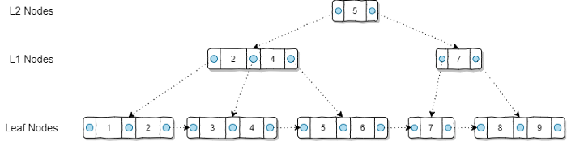
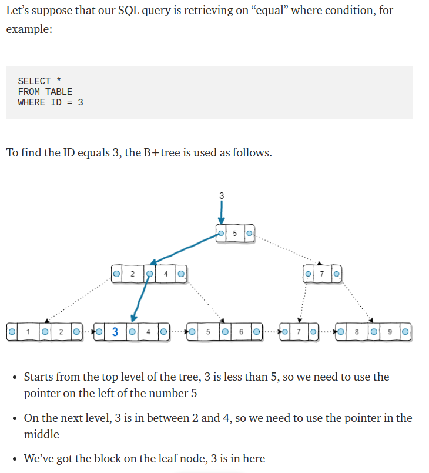
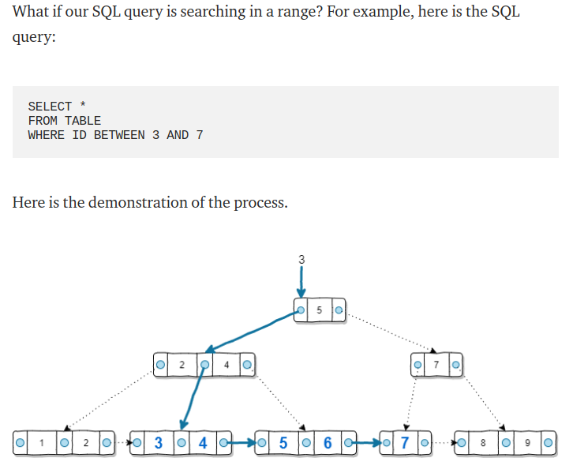

Useful links:

B-tree:
https://www.youtube.com/watch?v=C_q5ccN84C8

B+Tree
https://towardsdatascience.com/why-we-need-indexes-for-database-tables-25198145a8ca

How B+Tree is created based on our data
https://towardsdatascience.com/how-b-tree-indexes-are-built-in-a-database-6f847fb3cfcc

PostgreSQL Indexing : How, why, and when.
https://www.youtube.com/watch?v=clrtT_4WBAw

### What is a database index?

Database index it's a sorted copy of the data from a column(s)
of a given table that is stored in a such way that we could perform very
efficient search by this column(s).

Each value of index contains original value(s) from a given column 
plus the id of original row.

The most common index is B+Tree (self-balanced search tree).

Let's imagine a phone book. It has such data as first name, last name and the phone.
It is ordered by last name. So if you want to find somebody's phone by the last name,
it would be pretty fast and easy (hint: binary search, log(n)).

However, what if you try to look up a person's phone by its first name? The search will
be very slow because it would be linear (you will have to look every entry in the book
one by one).

question id: daeaa1c2-7cc4-477a-ae29-a994f5406bce

### What are benefits of using an index on a database column?

Without index your RDBMS have to perform linear search on a data in column.
With a B+Tree index time complexity of search becomes logarithmic - O(log(n)).

question id: 1bfa805c-fdc8-49b9-b1c3-ae722113bf37

### What is a downside of using index on a column and why?

- writing to an index column is slower than in a usual column 
- indexes consume space, because it is actually a copy of all values of a column

Though the speed of writing is affected not that much, because it is O(log(n))
It's O(log(n)) because you have to rearrange your index on insertion a new value.

Still you want to have as many indexes as necessary, but as few as possible.

question id: 2616429b-08cd-413e-872b-fab10ed4246a

### What happens when you turn on indexing for a column?

RDBMS creates a copy of this column and stores it as a B+Tree on a disk. 
Each value in a B+Tree contains a value from the colummn and an id of the original row.

question id: eadcf926-d6a8-42ba-b1ac-abeaf3e4cab2

### What is a B-Tree?

B-Tree is a self-balancing search tree that is optimized to reduce the number of disk accesses.

question id: 219fc0df-b575-406b-a977-e87011481d36

### What number of disk accesses is required for the B-Tree operations (search, insert, delete, max, min, ..etc)?

Most of the tree operations (search, insert, delete, max, min, ..etc ) 
require O(h) disk accesses where h is the height of the tree

question id: 49cb6df1-0f19-4cac-8f32-0af24a1eedeb

### What is node size of B-Tree in general? 

Generally, the B-Tree node size is kept equal to the disk block size.

https://www.geeksforgeeks.org/introduction-of-b-tree-2/

question id: 9d9ad766-d124-4d84-b940-048e398d807c

### Why is storing data as a B-Tree (or B+Tree) better than linearly?

If we do not use index, when we search, we have to search linearly throughout the whole column. 
And if we cannot load all data to the RAM, we have to do a lot of disk accesses which slows us down.

However, if we store data as a B+Tree, we reduce the number of disk accesses drastically. 
Most of the tree operations (search, insert, delete, max, min, ..etc ) 
require O(h) disk accesses where h is the height of the tree.

question id: cf3010bb-3263-44e4-ad12-3674146d5dff

### When B-Trees are useful?

When we cannot store all the data in RAM, so we have to work with relatively slow disk memory - HDD or SSD.

question id: f9b884e4-a42a-45c5-b56f-1dca80db6c92

### What a B+Tree differences from a binary tree?

- all leaves at the same level
- balances itself
- one node can contain several keys
- the bottom level has all the values of a tree
- bottom level is also a linked list so we can traverse it without going up to parents
- generally, the B-Tree node size is kept equal to the disk block size
- all keys of a node are sorted in increasing order

https://www.geeksforgeeks.org/introduction-of-b-tree-2/

question id: 929820cc-b567-4974-ab62-7e408b0dcd85

### What is time complexity of B+Tree operations like search, insert and delete?

answer:

O(log(n))

question id: cb4d4ae7-2ea8-4fcf-8d57-18a0b1aabb60

### How do we look for an exact value in a B+Tree?

answer

question id: 91b28d82-1bed-4e68-bb69-2d122a81ded7

### How do we look in B+Tree for a range of values?

answer:

question id: cd8150fe-fb23-488f-bbdd-5ff22b320f92

### Does it make sense to put index on a boolean column?

It ration between true / false / null value is more or less even, index will not increase the speed of querying.
However, if in your column of 1 000 000 boolean values and only five of them True, looking scanning
linearly all million of values would be not as efficient as looking up via index.

https://www.z-car.com/blog/mysql/mysql-should-you-put-an-index-on-a-boolean-field-to-help-query-performance

question id: 322be7a0-5087-4689-a9b6-16e674394bd0

Partial index
You can create index on calculated result of some function

How is B-Tree optimized to be stored on a disk?

Disks can only read and write (large)
fixed-size blocks of data at once. A B-tree stores multiple keys in each of its nodes so that (1) a single disk
read can access a lot of keys, and (2) the branching factor of the tree is very high (in practice, 1000+), so
that a tree of small height can store a huge number of keys, any of which can be accessed with just a few
disk operations

https://classes.engineering.wustl.edu/cse241/handouts/btree.pdf

### How is B+Tree different from B-Tree?
 
https://towardsdatascience.com/why-we-need-indexes-for-database-tables-25198145a8ca

-  “Leaf Nodes” level is supposed to have all the values of the field that this index was created on. 

question id: 
