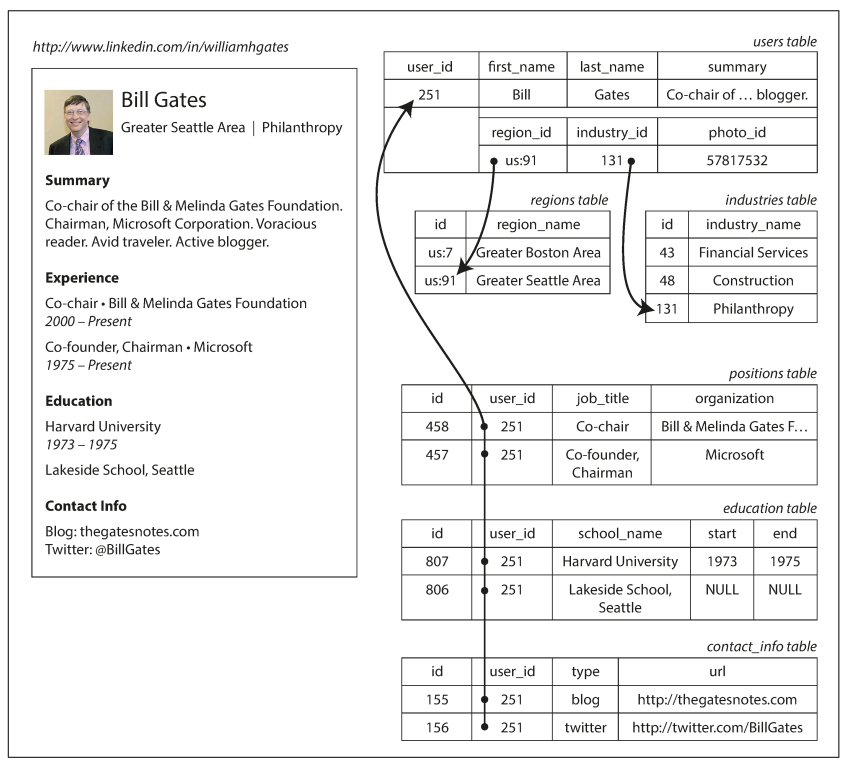

### What are differences between relational and non-relational databases?

Relation databases are based upon tables and foreign keys.
Tables contain rows of our data and foreign keys allow us to create relations between tables.
Relational dbs are good for well-structured data, because they have a lot of tools to make
sure our data is consistent and complies with defined structure.

Non-relation databases in general are more suitable for data that is not very well structured, for example
a JSON with a tons of arbitrary keys.

Also, NoSQL databases are much better at horizontal scaling and at handling a lot of connections at the same time,
which is good for applications with high-load.

Btw, in some relation databases, there is an ability to store unstructured data. 
For example, there is JSONB type in Postgres, where you can store json.
And not only store, but query as well. So you can have best of two worlds.

question id: 89fbb3f8-de39-4649-8ff0-29026842e5c6


### When Relational model is more sutable for your data than Document model?

- when you want to enforce rigid structrue(scheme) for incoming data (any step from a schema is an error and should not be put in your database)
- when your data is highly interconnected and more complicated than simple tree like structure
- when your more often query small pieces of information rather than the whole document

question id: 62e6a61f-e1eb-4ba5-8e18-c0fb2c7feef5


### When Document model is more sutable for your data than Relational?

- when you data has simple tree-like structure and you query the whole document rather than it pieces most of the time
- when you don't need to or can't control the structure of incoming data
- when your more often query the whole entry with the whole tree of data rather than small pieces of information

question id: d49c1181-645c-4df0-87a6-9461dca92787


### Provide an example where Document model is more suitable than Relational model and explain why

Sometimes, for some data, relational approach seems a bit of an overhead.
Let's image an example with somebody's CV. 

It can be stored as a table of users with some basic information like name, birth date etc, and 
additional information for number of this persons' education entries, work experience entries etc.

So in order to store one CV in relational database you have to have several tables.
And in order to query a person's CV your RDBMS has to perform several joins.



In case of using Document model (like in MongoDB) you can store the entire CV
as one simple JSON. Like this:

```json
{
"user_id": 251,
"first_name": "Bill",
"last_name": "Gates",
"summary": "Co-chair of the Bill & Melinda Gates... Active blogger.",
"region_id": "us:91",
"industry_id": 131,
"photo_url": "/p/7/000/253/05b/308dd6e.jpg",
Relational Model Versus Document Model | 31
"positions": [
	{"job_title": "Co-chair", "organization": "Bill & Melinda Gates Foundation"},
	{"job_title": "Co-founder, Chairman", "organization": "Microsoft"}
],
"education": [
	{"school_name": "Harvard University", "start": 1973, "end": 1975},
	{"school_name": "Lakeside School, Seattle", "start": null, "end": null}
],
"contact_info": {
	"blog": "http://thegatesnotes.com",
	"twitter": "http://twitter.com/BillGates"
	}
}
```

The moral of this story is: if your data has tree-like structure and most of the time you need read/write the whole entry,
Document model provides less overhead thereby faster speed.

question id: 501b82f0-26ee-4815-adc5-88cc49fc09c4


### What data structure is Document model not so suitable for?

For data structrue that has many-to-one and many-to-many relationships

Some examples:
You have user's CV that you can store either as bunch of tables that related 
to each other or as a simple JSON document.
Things like work experiens (period of time when person worked somewhere) can 
be storeD in another table forming one(user)-to-many(work-perions) type
of relation ship which is fine both in relational and document model.
Also every user lives in some country. This forms a many(user)-to-one(contry) type of relationship 
which fits into relational data just fine, while it doesn't fit to document model because 
it is a kinda upside down tree.
In this case you still have to split data and perform joins like in a relational database.

While many-to-many relationships and joins are routinely used in relational data‐
bases, document databases and NoSQL reopened the debate on how best to represent
such relationships in a database. For now it is not that different from relational model:
if we want to use many-to-one or m2m relationship, we can use document reference (counterpart of a foreign key).

question id: fbe4fe8e-5515-4ba9-b7d9-dddf40548e90


### What are the main arguments in favor of the Document data model? (3)

- schema flexibility (e.g. don't need to establish new colums if input has new keys)
- better performance due to locality (don't need to join tables because all data lies in one entry)
- for some applications it is closer to the data structures used by the application (so you don't have to translate JSON-payload to relational-model rows)

question id: 1512f79e-7147-4df0-b198-23ade9027a76


### What could be wrong with storing tree-like data structure as different related tables? (2)

- You have to spend some time to define all these tables and relationship
- If most of the time you need the whole data from all of these tables - 
why to split data on tables anyway? It would only slowen the reads and writes to the database

question id: c0ea1851-1feb-493f-b48b-91d7ac65672b


### What are three most common groups of databases based on data model?

- relational
- document
- graph

question id: 4f615d79-d679-460e-8e77-73d99dc11b93


### When it is the best to use relational, document and graph database?

Document databases are convenient for tree-like (hierarchical) data, but 
it is not as sutables for many-to-one and many-to-many relations.

Relation databases are better for many-to-one and many-to-many relations,
but can be an overkill for tree-like structured data.

While relational databases can handle many-to-many relations, where there
are a lot of them, it is more convenient to use graph databases.

question id: 6b9d405e-7c59-4e1f-bb6d-8aa0779f1644


structure:
table | table or document (json) or graph

storage:
typically on one machine | typically distributed

scale:
nosql databases are much easier to scale

access:
sql | rest api or vendor specific language


Main two things that relation databases are based upon is tables and foreign keys.
Tables contain rows of our data and foreign keys allow us to create relations between tables.


In NoSQL databases information can be stored as a document (like in MongoDB) or as a graph (there are other types.)
NoSQL database do not care that much about relations.

NoSQL databases are better for storing unstructured data whereas relation databases win where you 
have information with clear and firm structure and you want to keep this structure.

In relational database writing data is slower because you have to make sure that data is consistent and complies with the structure of your database, but
reading is much faster because everything is structured.

Writing to a NoSQL database is generally faster than in relation database because there are not so many strict rules and check and data is mostly
unstructured. However, to get data in structured way from NoSQL database is slower.

NoSQL databases are good for fast writing in them since we are writing unstructured data and don't spend time on checks and validations as in relational databases. Also, NoSQL dbs are better at scaling and they work better with tons of connections, whereas relation databases do not scale that well and not good at handling a considerable number of connections.

