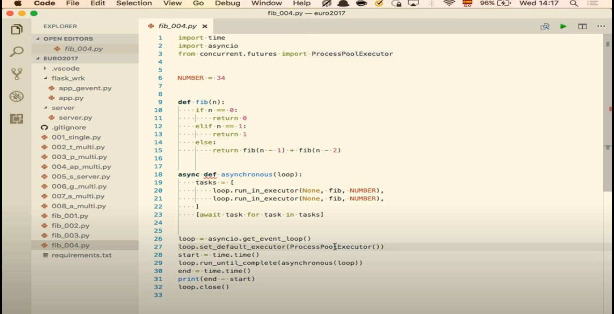

### How to run async script?

```python
import asyncio

async def main():
    pass

if __name__ == '__main__':
    asyncio.run(main())
```

The .run function always creates a new event loop and closes it at the end. If you were using the lower-level APIs, 
then this would be something you’d have to handle manually (as demonstrated below).

```python
import asyncio

loop = asyncio.get_event_loop()
loop.run_until_complete(hello_world())
loop.close()
```

question id: 0b778831-da0a-459e-b906-d99da99e44b4


### How to run an async function in a loop?

```python
import asyncio

async def foo(position):
    print(f'{position} run...')

async def main():
    tasks = [foo(i) for i in range(1, 11, 1)]
    await asyncio.gather(*tasks)

if __name__ == '__main__':
    asyncio.run(main())
```

question id: 5680595e-209c-4daf-aa21-1767ee155da4


### What is the difference between threading and async in Python conceptually?

Threads are like workers. Each does it's task. But in Python only one worker is allowed to do something at any
given point in time because of the GIL. And Python switches between this workers all the time. 

With async you have only one worker. But he does all the tasks from the task queue. He constantly switches between them
in order to do them all not one by one, but somehow simultaneously.

So in Python because of the GIL it looks more or less the same in terms of performance.

question id: 9fc64221-a045-417e-adf6-cf3ed8e77295


### What is asyncio.create_task()?

answer
Method asyncio.create_task() schedules async function. It will run in background. And you don't have to await it, 
so you can run it even from synchronous function. For example, in `__init__()`. 

For example, lets assume that g() and f() are both async functions. The simplest way to run them would be: 
```python
result_f = await f()
result_g = await g()
```

However, the coroutines do not run concurrently. g() only starts executing after f() has finished.
To run them concurrently we can use asyncio.create_task() like this:

```python
task_f = asyncio.create_task(f())
task_g = asyncio.create_task(g())

await asyncio.sleep(0.1) # <- f() and g() are already running!
result_f = await task_f
result_g = await task_g
```

Your tasks now run concurrently and if you decide that you don’t want to wait for task_f or task_g to finish, 
you can cancel them using task_f.cancel() or task_g.cancel() respectively. Please note that you must create both tasks 
before you await the first one – otherwise you gain nothing. However, the awaits are only needed to collect the results 
and to clean up resources.

However waiting for each of them like this is not very practical. In real-life code you often enough don’t even know how 
many awaitables you will need to wrangle. What we need is to gather the results of multiple awaitables.

https://hynek.me/articles/waiting-in-asyncio/

question id: f105982c-afeb-4dee-b492-6796c678976e


### When could asyncio.create_task() be useful?

answer
- when you want to execute asynchronous function inside synchronous one. For example, in `__init__()`. 
- when you don't need to wait for it to be finished before move on to next line of code (short and forget)

https://hynek.me/articles/waiting-in-asyncio/

question id: 74d090eb-6581-4e92-8822-14199daa9997


### What is asyncio.ensure_future()? 

answer
I don't know for sure it, but you are most probably don't need asyncio.ensure_future(), it's pretty low-level. Use
asyncio.create_task() instead.

https://github.com/python/asyncio/issues/477#issuecomment-268709555

question id: 09ebbbfb-2186-46a2-b6f3-34cfecc7a31f


### How to run blocking synchronous function from asyncronous code?

answer:

Use 
```python
result = await loop.run_in_executor(None, functools.partial(your_func, args, kwarg=kwargs))
```
question id: 6c7e3d90-9f34-428e-9cd8-2e4730f8b774


### How to run blocking synchronous function from asyncronous code?

Use loop.run_in_executor() to fire up your blocking call in a new thread

Example
```python
async def sleep_test():
    loop = asyncio.get_event_loop()
    print('going to sleep')
    await loop.run_in_executor(None, time.sleep, 5)
    #time.sleep(5)
    print('waking up')

async def parallel():
    # run two sleep_tests in parallel and wait until both finish
    await asyncio.gather(sleep_test(), sleep_test())

asyncio.run(parallel())
```

Running this code shows that both instances of the coroutine sleep in parallel. 
If we used time.sleep() directly, they would sleep in series because 
the sleep would block the event loop.

This example is of course silly because there is asyncio.sleep() 
that suspends a coroutine without spending a slot in a thread pool, 
but it shows the basic idea. Realistic use cases for run_in_executor include:

integrating CPU-bound code, such as numpy or pandas calculations, into an asyncio program
invoking legacy code that hasn't yet been ported to asyncio
blocking calls where non-blocking APIs are simply unavailable - e.g. proprietary 
database drivers, or blocking OS-level calls such as those for file system access

https://stackoverflow.com/questions/55027940/is-run-in-executor-optimized-for-running-in-a-loop-with-coroutines
https://docs.python.org/3/library/asyncio-eventloop.html#asyncio.loop.run_in_executor

question id: 33c01ce0-6f45-468a-bc69-b819de80608b


### How to run CPU-heavy synchronous code from asynchronous code?


Use `await loop.run_in_executor(your_function)` with ProcessPoolExecutor from concurrent.futures.
It will start a new process and will execute your function in it. Default executor in asyncio
is ThreadPoolExecutor, so you have to change it first like on the screenshot.



https://youtu.be/VWoyeq_ujJ4?t=1043

question id: f4d7e789-56bd-46fb-9a77-c6d89d97c8d6


### How to run asyncronous function from syncrhonous code?

answer:

```python
asyncio.run(your_function(your_args)))
```

question id: 22866d5b-4014-4b21-b287-c3f4d9f5fe9d


### When does a Task give up the control?
How to force an async func to yield control back to the loop and why you might need it?
- when it is finished
- when it waits for a timer or callback to trigger

It won't pause, won't give up the control on await if it doesn't
have anything to wait on.

question id: 42ccfa6b-94fe-4b1d-a292-bf58b74f6aa1


### How to force an async func to yield control back to the loop and why you might need it?

answer:
First of all, why you might need it. We all know that in an asynchronous function, as soon as
interpreter hits `await ...` directive, the function (coroutine) yields the control back
to the event loop. It's not exactly like this.
The truth is, that if there is nothing to wait on (no waiting on http or i/o request to be finished),
the same coroutine will continue working and won't let the control back to the event loop. It will
be executing until it's finished.

In order to force the asynchronous function yield control back to the event loop, you can put
`await asyncio.sleep(0)` in place where you want your coroutine pause and give up the control.
It seems like a crutch, but at least is was Guido who suggested doing it (I found it in an issue somewhere on github).

question id: 3fb4dc13-b92e-40b9-a76a-716f802d5ea3