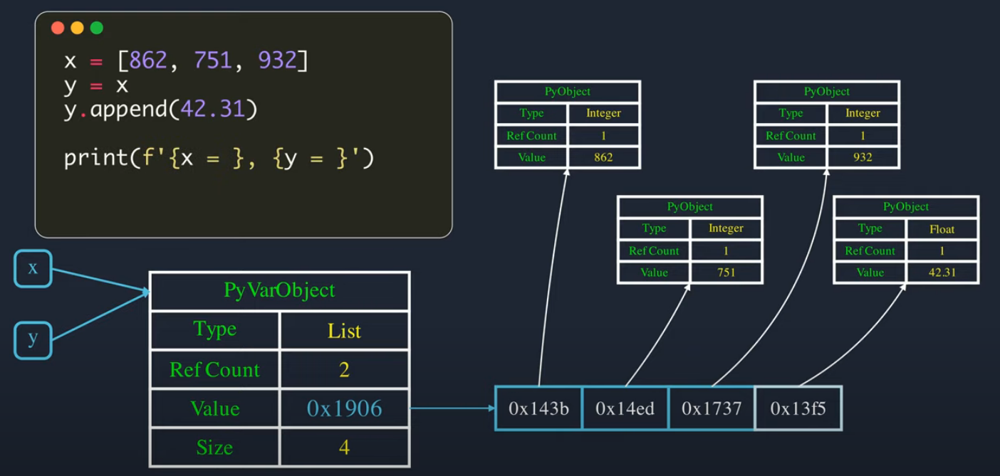

### How to get index of an item within the list by this item?

For example, you have a list with a million words. How to find
an index of word 'cat' from this list?

answer
```python
l = ['sport', 'sex', 'soul']
l.index('soul')  # 2
```

question id: 37102018-0d32-4d04-bc09-151dcea82b90


### What exceptions will it raise?

```python
a, b, c = [1, 2, 3]
```

answer

It is legit unpacking expression. 

question id: 06270d23-f16a-491c-902f-9432d15238e2


### What is the difference in result between `some_list[i]` and `some_list[i:i+1]`? 

answer

```python
some_list[i]  # returns item
some_list[i:i+1]  # returns [item]
```

question id: 62356efd-c592-4cd4-9a5c-937bc007a786


### How to get an item from a list as a list containing this item? 

answer

```python
some_list[i:i+1]  # returns [item]
```

question id: 24329eee-0d32-4be4-8b66-d5d68195593f


### Why do NumPy faster with math than Python?

Because, for example, you want to get a sum of every float in a list. Every time Python iterates through a list of 
floats, to get it from memory, Python builds a new object. So if you have one million floats in your list, Python
interpreter will build a million of float objects in order to start manipulations with them.

Numpy doesn't build a new object for every item in a list. It is able to perform math operations right on raw values
instead. And builds only one object - to return you the result.

question id: 141128d0-fa4d-42e1-ac5d-fec4de155053


### What Python data structures contain doubly-linked list?

Queue and OrderedDict

question id: 74910023-4e40-43b4-b0f5-ae90e5071716


### How does Python list and tuple store values?

Python list and tuples store addresses to objects with values instead of objects itself

question id: 72b43942-9e15-49b3-a576-41ce105dfd68


### What is the data-type that used under hood of a list or tuple? Array? Linked-list? Double-linked list?

answer

Basically, it's an array - a homogeneous sequence of contiguous blocks of bytes in the memory. 

question id: 2af28856-b474-4b41-9a0a-ee520102ad31


### How can be a tuple and a list based on array if they can contain completely different types of 
data?

answer
A tuple and a list contain only address in memory to different objects of different types, not the
actual data itself. And these addresses are homogeneous - same type, same length. So array suits
for them perfectly.

question id: ffcf21fb-04c7-4977-bb12-2296a397180c


### What does Python list consist of?

Python list only contains its length, the size of its storage and the address to the block of memory
where actual addresses to you list items are stored. Why so? Because this block of memory can be
ditched when we need a new, bigger block, if we add more values to the list, for example:

question id: 630e221e-1e0a-4e0f-9a11-8684b2450f58


### How does Python list look in memory? 

for example, just simple l = `[1, 2, 3]`

answer
In this example, my_list is a binding to PythonVarObject in memory. The PyVarObject consists of the
following fields:
- type
- refcount
- value
- size

Where type is type of the object (list in this case).
Refcount is number of variables pointing to this object.
Size is number of elements in the list.
Value is an address in memory, that points to an array of another addresses in memory. What are these 
addresses? They are addresses of other Python Objects in memory. See picture: 



question id: 54a07460-fee5-4f8d-ac4a-af272b4615e0


### How does Python list grow? What is going on under the hood? 

-> we create an empty list 
-> Python interpreter allocates an array in memory, lets say, for 4 items
-> we add 2 items, the array of our list is half empty (2/4)
-> we now want to add 4 items more
-> Python interpreter allocates new, bigger array, copies data from the old one, add 4 items that 
we wanted to add to the new one, deletes the old one
-> since we have a new array in another part of memory, interpreter changes address in our list 
so our list points to the new, bigger array

question id: 4f618f01-1145-4cdc-8961-db55b6c94c2f


### Why do we need to reallocate an array for a list when we add new items?

- we don't know it's size in advance, so initially we allocate an array with some extra empty slots
- it would be way too memory consuming to allocate for an empty list a one billion-cells array right away

question id: b78ba515-e932-4050-a9c0-5ccd4d3f203f


### When do we reallocate an array for a Python list on appending new elements and why?

The growth pattern is: 0, 4, 8, 16, 25, 35, 46, 58, 72, 88, ...

If we append to a list one value at a time, the number of copied values due to reallocation is 
more or less in linear correlation with number of appended elements, and it is considered pretty good.
For example if you add 1,000,000 elements to your list one by one, the total number of copied
elements will be 9,058,551,346

question id: c669c736-5b8c-42bc-8306-fb4af79384e6


### Brandon Rhodes says that Python list on average used 94% of its slots. Why do we need this 6%
of empty slots?

Python list allocates an array for its values with more 'slots' than we have values to store. We 
need this extra space in case there would be even more value to store, because we don't want
to reallocate an array every time a value is added to the list. Why? Because it takes copying the 
whole list to a new array to somewhere else in the memory.

question id: f917423f-3ba9-4eca-8be4-8a259e58aa5a


### What happens when you do this?

```python
some_list.pop(0)
```

You remove the first item from the list. Which leads to the rest items should be shifted to the 
left, one by one, and as you can understand, it's a costly operation of O(n). Avoid 
doing that or use linked list. 

question id: 359d6a4f-ec86-42b4-adfd-0cb4147d2ab4


### How to iterate over a list (or any ordered sequence) from the end to the beginning? 

answer
You can use built-in `reversed()` function, that  returns an iterator that accesses the given sequence in 
the reverse order.
The upside is that you don't need to reverse a list or create a new one for that (both of this
operation are costly).

```python
for item in reversed(my_list):
    print(item)
```

question id: d1eebe51-f25d-4196-8937-fd7844ef0120


### What is the difference between slicing in vanilla Python and NumPy/Pandas?

When you take a slice from a list, Python returns you a completely new list. However, in NumPy
and Pandas slices are just views, they don't create new list, they create a view which looks like a 
list, but actually you just work with a part of your original list. That improve speed of your
program by avoiding to copy parts of your list.

question id: ae516536-17b1-455b-9478-62c49bd041e0


### What is list.pop() for?

With .pop() you can return a value from the list and remove it from the list at the same time.
It takes an optional argument 'index' (of value that you want to remove and return. Without this 
argument .pop() removes and returns the last value of the list. )

question id: db134700-a072-4727-bb5d-a9a2a15d63d0


### Print out last 15 items of a list

```python
l = list(range(100))
l[-15:]  # [97, 98, 99]
```

question id: a3b0c345-affc-4827-b7b6-a28dc271e76c


### How to get every Nth element from a sequence to a new sequence?

Given sequence:
list(range(101))

answer

```python
my_sequence = list(range(101))

my_sequence[::15]  # [0, 15, 30, 45, 60, 75, 90]
```

question id: 7449491f-78ca-47e9-ad7a-442049db5c07


### How to put items from one list in between items of the other?

list1 = list(range(20))
list2 = [999, 998, 997]

How to put all elements of list2 two between 2nd and 3rd element of list1?

```python
list1 = list(range(20)
list1[1:2] = list2
print(list1) # [0, 999, 998, 997, 2, 3, 4, 5, 6, 7, 8, 9, 10, 11, 12, 13, 14, 15, 16, 17, 18, 19]
```

question id: 67a478ec-a04a-4363-b223-534e3e14ab9c


### How to delete first N items from the list?

answer
```python	
l[:N] = []
```

question id: 2053f508-195d-4bf6-ba93-d0fa403f617e


### How to declare a list with predifined capacity?

In Rust you can delcare an empty Vector with some capacity to avoid overhead of
 expanding it when you add a lot of new elements.
Can you do something like this in Python?

```python
your_list = [None for i in range(100)]
```

question id: 7ad91ee1-654a-41a9-ba98-9643af04a20a


### How to clear a list?

```python
my_list = list(range(100))
my_list[:] = []

# or
my_list.clear()
```

question id: 06145602-03c3-4dce-9f06-485fbb49489d


### How to create list which can only take one variable?

answer:

```python
[history_record] = db.query(JobRequestHistory).all()
print(history_record)  # {JobRequestHistory at 0x3435jlj}
```

It will raise error if there number of items in iterable on the right 
is not equal to number of the variables inside list

question id: d21d78a2-b6fc-43b9-a8d4-e4be0be7e528


### What does this syntax mean?

```python
[history_record] = db.query(JobRequestHistory).all()
print(history_record)  # {JobRequestHistory at 0x3435jlj}
```

answer:

It will raise error if there number of items in iterable on the right 
is not equal to number of the variables inside list. You can use
`history_record` afterwards though. 

question id: d68c4cf6-9480-4cff-b817-87eadb3d954d


### What would be the output?

```python
a = [1, 2, 3]
b = a
print(b)  # [1, 2, 3]
a = []
print(a) # []
print(b) # ?
```

answer

```python
a = [1, 2, 3]
b = a
print(b)  # [1, 2, 3]
a = []
print(a) # []
print(b) # [1, 2, 3]
```

question id: 528ed143-061b-4e1e-b6e2-5df0a72e2b35


### What would be the output?

```python
a = [1, 2, 3]
b = a
print(b)  # [1, 2, 3]
del a[:]  # equivalent to a[:] = []
print(a) # []
print(b)  # ?
```

answer

```python
a = [1, 2, 3]
b = a
print(b)  # [1, 2, 3]
del a[:]  # equivalent to a[:] = []
print(a) # []
print(b)  # []
```

question id: c11bc84a-e223-450d-8726-a89ab46d5954


### What would be the result of this expression?

```python
[] * 10
```

answer


```python
[] * 10  # []
```

question id: b1b21d23-c80b-43ca-9ba4-35747267a0ab